# Introduction to training classifiers
*Created by Lauren Chronister, Tessa Rhinehart, Sam Lapp, and Santiago Ruiz Guzman*

This document is intended to serve as an introduction to the classifier training workflow and considerations that need to be made before diving in rather than a programming how-to. For more detailed instructions on **how** to use OpenSoundscape, see the <a href="http://opensoundscape.org/en/latest/" target="_blank"> documentation</a>.


# Uses of automated sound classification
The purpose of a **classifier** is to take some data and assign a "class" to it. Let's say you have some audio data that you recorded in the field. You're trying to find some particular "classes" of sound: like a particular bird species's call, the noise of a chainsaw, or a chorus of frogs.

In the example shown in Fig. 1, six different bird species can all be seen on a "spectrogram," or an image of a sound track which displays sound in terms of timing (x-axis), pitch (y-axis), and relative loudness (darker parts are louder). Note how different each of the boxed sounds looks compared to all the others. Animals in nature which produce sound are usually trying to send messages to other members of their own species. To do this, they must be identifiable from other sounds around them, and it must be clear whether they're saying something like "this is my turf" versus "look out, hawk!" This fortunately makes the task of human classification of sounds relatively simple (in most cases but not all).

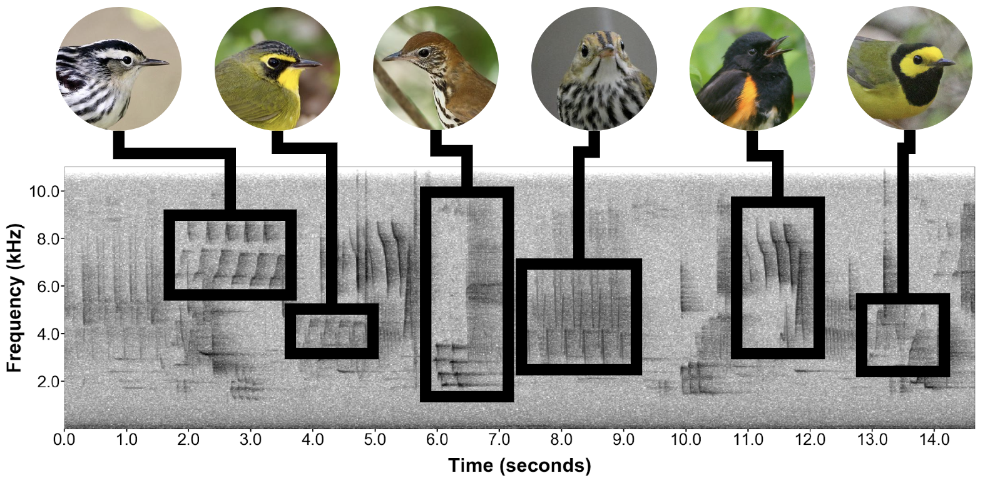
Fig. 1. A ~15 s spectrogram containing the songs of six bird species. Some examples of songs are boxed and the species that made them are displayed above. From left to right: Black-and-white Warbler, Kentucky Warbler, Wood Thrush, Ovenbird, American Redstart, and Hooded Warbler.<a href="https://www.aba.org/wp-content/uploads/2020/04/Birding_20-2_11-Birdsong-ext.pdf" target="_blank"> Source</a>.

## Kinds of classifiers 
Many different types of classifiers for sound exist, but we typically use something called a **Convolutional Neural Network**, or **"CNN"** for short. This is a type of classifier created using machine learning. This type of classifier uses spectrograms to assign a score to sound clips based on how confident it is that a sound clip belongs in one of the classes it has been trained to recognize. CNNs can have any number of desired classes which can range from all the vocalizations produced by a bird species, to specific vocalizations of a bird species, to sounds such as gunshots. Fig. 1 could represent all of the classes in an example CNN.

CNNs are not the only solution, nor the best solution to sound classification in every case. CNNs work best when a sound is relatively complex like the songs of most songbirds and when sounds are highly variable or inconsistent. Some animal sounds are much more like simple, repeated pulses which are highly consistent but could be mistaken for other environmental sounds by a naive observer. For such purposes, this lab has also developed other classifiers which rely on the periodic structure of simple sounds to classify them, which we often refer to as **signal processing** algorithms. [RIBBIT](http://opensoundscape.org/en/latest/tutorials/signal_processing.html) (which stands for "Repeat-Interval Based Bioacoustic Identification Tool") is one of these classifiers which can be used for animals such as certain frogs (see Fig. 2 below for an example). Another was created specifically to classify the accelerating pulses of Ruffed Grouse drums <a href="https://doi.org/10.1002/wsb.1395" target="_blank"> (Lapp <em>et al.</em> 2022 <em>Wildl.Soc. Bull.</em>  e1395)</a>. This document focuses on the training of CNNs, but be aware that signal processing algorithms are options for sound classification.

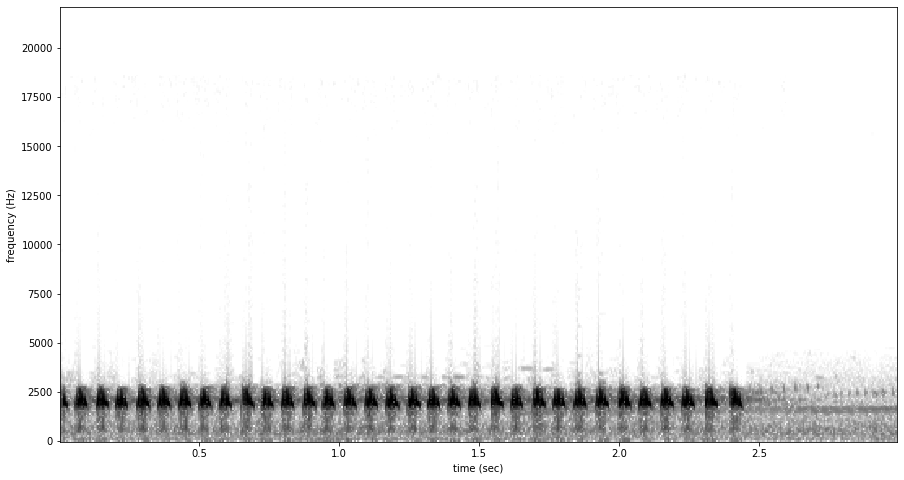

Fig. 2. A spectrogram of a Great Plains toad call; a sound suitable for classification using RIBBIT.<br>

Beyond this lab, you may see others use certain **clustering** algorithms as classifiers such as that available from Wildlife Acoustics through [Kaleidoscope](https://www.wildlifeacoustics.com/products/kaleidoscope/cluster-analysis). These work by grouping together similar sounds for further review. Others may use **template matching** algorithms such as the one available in [RavenPro](https://ravensoundsoftware.com/wp-content/uploads/2017/11/Raven14UsersManual.pdf) which slides a template spectrogram over audio data to score how well the audio matches the template.

## CNN classification problems
The following are some examples of the types of questions we have asked in this lab and CNN classifiers we have or could create to answer them.

### Example 1: Warbler song types
Many warbler species such as the Chestnut-sided Warbler have been known to begin their breeding season singing predominantly a "type 1" song and switch to predominantly singing a "type 2" song after they have found a mate <a href="https://doi.org/10.1139/z89-065" target="_blank"> (Kroodsma <em>et al.</em> 1987 <em>Can. J. Zool.</em>  67(2):447-456). </a> Could we use the switch between type 1 and type 2 songs to say something about where and when female Chestnut-sided Warblers choose to pair with males? It seems biologically plausible that females might choose to mate with males that have better territories for supporting broods. This might lead to a pattern of earlier switches from type 1 to type 2 song in higher-quality habitat.

To help answer this question, we would need a CNN which can identify both Chestnut-sided Warbler type 1 song and Chestnut-sided Warbler type 2 song (see Fig. 3 below). These two song types would present as different classes for the CNN to classify audio clips into.

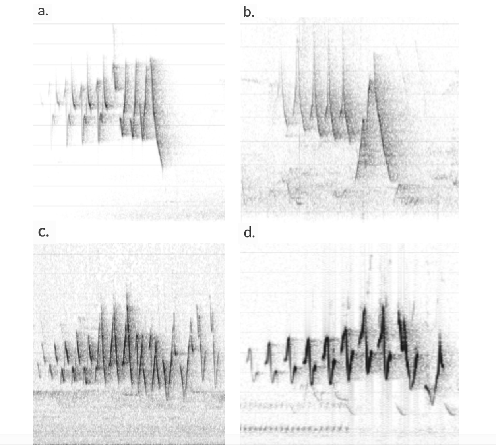

Fig. 3. Examples of Chestnut-sided Warbler songs. On the top row (a and b) are type 1, and on the bottom row (c and d) are type 2.

### Example 2: Declining forest birds

Many forest bird species across Pennsylvania are undergoing declines due to changes in forest composition and structure as forests in Pennsylvania age. Experimental treatments of forest stands are being conducted to determine if these treatments can help restore populations of declining birds. Do forest treatments help Wood Thrush, Cerulean Warbler, and Golden-winged Warbler in Pennsylvania?

This problem seems simple enough but one added complication is that each of these target species has a neighbor with a similar song (i.e., a **confusion species**). For the Wood Thrush, its confusion species is the Hermit Thrush. The Cerulean Warbler and the Golden-winged Warbler have the far more common Black-throated Blue Warbler and Blue-winged Warbler, respectively, as their confusion species.

So to answer this question while minimizing interference by the presence of confusion species, we need a CNN which can classify both the three target species and their set of three confusion species. Each of these six species would present as a different class for the CNN to classify audio clips into.

# Organization

<u>Organization is key to reproducibility</u>

This can't be said enough. Training a CNN is an iterative process. As you improve previous classifiers, you will end up with different versions of classifiers with different training parameters and different training data.

Imagine you're at the point of publication and you need a record of all of the data sources you used to train your final classifier. Along the way, you added additional clips of your study species to the training data for the classifier to improve its performance. Some of these clips made it into the final classifier while others did not. Unfortunately, it's been too long since you trained it and you've forgotten which data you trained your final model with. You didn't keep a record of the clips you used and now you have to piece together how you made the model. This could be a problem for anyone who wishes to use your procedures to reproduce how you made your classifier in the future. Avoiding the mistake of poor record-keeping along the way can save you time and frustration.

Here's a simple list to follow which can help keep you organized:

a. Use some form of versioning your files **consistently** We provide a couple of options here, but you can come up with your own plan of action.
   - **Slap a date stamp on everything.** 
   - When you create new versions of training scripts, training datasets, etc. add a datestamp to them and save a new copy so you know which version they are (e.g., 2022-10-01_train_model.py -\> 2022-10 05_train_model.py).
   - You can automatically add datestamps in your code like such: 

```
from datetime import date
todays_date = date.today().strftime(‘%Y-%m-%d’)
…
training_data.to_csv(f”{todays_date}_{project}_train.csv”)
validation_data.to_csv(f”{todays_date}_{project}_validate.csv”)
…
model.train(
	train_df = training_data,
	validation_df = validation_data,
	model_save = f”{path_to_saved_models}/{todays_date}_{project}”,
	…
	)
```

   - If you will be making multiple versions in the same day, use a timestamp as well.

   - **Use git versioning.** This is a little more advanced, but it can help you keep a record of changes you may have made to files over time, [Here's an intro](http://datasci.kitzes.com/lessons/git/) Justin Kitzes wrote on how to use it.

b. **Keep rigorous notes on why and when you do something.**
   - Just like keeping a notebook of experiments in a wet lab, you should take notes every time you sit down to work on a project.
   - You might, for instance, be trying to improve the performance of a classifier by adding in new overlays or negative training clips by using high-scoring negative clips from testing. Keeping record of why and how many you add in will help you keep track of the methods you used later on.
   - Some of us use note taking apps such as [Workflowy](https://workflowy.com/) while others keep pen-and-paper journals. Other approaches include using a Google Document or a Jupyter Notebook. Choose the method that works best for you and encourages you to keep notes.


c.  **Create readme.txt files where you keep your training scripts, data, and model files.**
   - Readme's are great for reminding yourself what you were doing with a project or any other people who might be jumping on the project as well.
   - A simple readme is just a log of what you were doing and why (similar to your notes but probably more succinct).It might look like this but can take on a different format:

```markdown
This readme was created for the {X project code} on {Y date} by {Z user}. Training scripts can be found in {A directory}, labels and
training clips in {B directory}, and models in {C directory}.

2022-10-01: I uploaded an initial training script and trained the first version of my model.

2022-10-05: After testing the model, I found it was not performing well on the target sound because of a confusion sound, so I added 100 of
these high-scoring confusion sounds to the overlays from {X labels file}. I trained a new version of the model.
```

d.  **Make final products "read only"**
     When you create something that you might potentially use in the future - for instance, a trained CNN classifier or a set of labeled data, you should give it a unique name (including a version number if it might be updated in the future: for example, "song8_cerw_cnn_v1-0.model") and make the file "read only" on your computer. This ensures you (or someone else) can't accidentally change the contents.


**A final note:**
If you are interested in learning more about how to make your work more reproducible, check out The Practice of [Reproducible Research](http://www.practicereproducibleresearch.org/).    

# Creating a training dataset

**This and the following sections pertain only to the training of CNNs; other types of classifiers are created in other ways.**

Creation of a training dataset is the least straight-forward and often most tedious part of the process. Thus, this section occupies the most space. Creating an appropriate dataset which can teach a CNN what you want it to learn requires a lot of thought and sometimes troubleshooting.

Training data can be thought of as **negatives** and **positives** for each specific class. A negative is simply a clip that is not an example of a class. A positive is a clip that is an example of a class.

## Step 1: Decide on sources of training data

Most typically, training data (in this lab) come in two mutually-exclusive formats:

1)  **Targeted recordings** from sound libraries such as [Xeno-canto](https://xeno-canto.org/), [Macaulay Library](https://www.macaulaylibrary.org/), or [WildTrax](https://wildtrax.ca) paired with field data that **does not** include the sound classes. 

2)  **Field data** containing the sound classes recorded by autonomous recorders. Many published annotated datasets include autonomously recorded sounds; for a list of annotated bird datasets, see [here](https://docs.google.com/spreadsheets/d/1KrmCB0vvSK7V3znJfycO-eOMZJKP2F-Ih6neRYPz1Xc/edit#gid=629410210).

### Targeted recordings with field data overlays

A mix of targeted recordings (i.e., directional recordings of a certain species frequently created using a parabolic microphone) and field data (i.e., non-directional recordings of no particular sound frequently created using **automated recording units**, or **ARUs**) is the most common source of training data we have been using to train CNNs. Field data are used as **overlays**. Imagine taking a translucent image and putting it on top of another image--the one on top is the overlay. Generally, we use overlays when we think the data for a class will not be representative of the recordings we want the classifier to predict on which are field data. Often, targeted recordings from sound libraries will be louder than what we see in field data and contain fewer background sounds.

The idea here is that you start with a set of targeted recordings which contains whatever the species of interest is. These are split into clips, some of which will contain the sound class(es) (Fig. 4a) and some will not (Fig. 4b). You also have a separate set of field data overlays which **do not** contain the sound class(es) (Fig. 4c). During the CNN training process, you "overlay" these field data clips on top of your sound class clips. This actually creates composite images that are averages of the two types of clips (so technically neither is really overlaid on top of the other; Fig. 4d). The classifier will (hopefully) learn that sounds contained in the overlays are not the subject of a class and that the sound classes can vary in loudness and context.

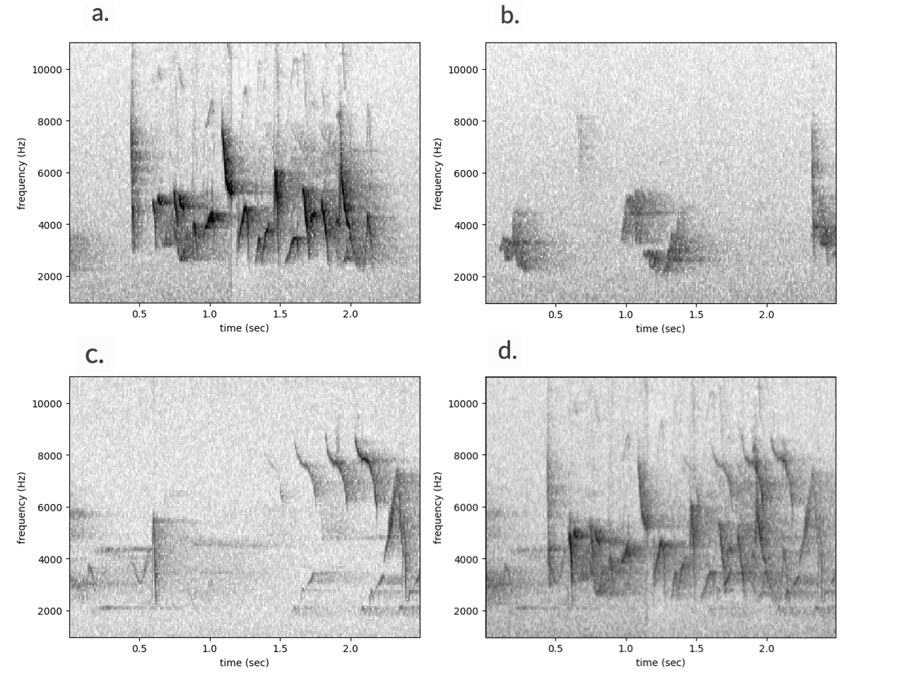

Fig. 4. Targeted training data clips sourced from Xeno-canto and field data overlays displayed as spectrograms. The first clip, a, contains a song of the Canada Warbler while the second clip, b, contains Red-eyed Vireo song from the same recording. The third clip, c, contains an American Redstart song from a different recording. Finally, c is overlaid on a with a weight of 0.5 (50% comes from a and 50% from c) to create a composite image used in training.

One easy source of overlays are pre-annotated datasets such as the "[PNRE dataset](https://doi.org/10.1002/ecy.3329)" or the "[Ithaca dataset](https://zenodo.org/record/7050014#.Y4-Lx-zMLuU)" because you already know exactly what these datasets contain making it easy to exclude clips that may contain your target species. The caveat is that you should not use a dataset you used for overlays as a test set for your classifier because the classifier has learned that those clips do not contain the target making it seem like it has better performance
than it really does.

### Field data

If targeted recordings are not representative of the field data I will be later predicting on, why use it at all? Why not just use field data? Targeted recordings paired with field data overlays might actually be advantageous in at least some situations.

   - You're interested in a sound that's hard to find examples of. You might be wasting hours of time just trying to search for it in field data  whereas you know with high certainty that it will be in recordings labeled with it from sound libraries.<br>
   - You're interested in a sound that's highly variable and may vary with geographic location. You may not have field data from a variety of geographic locations, but there's a high chance sound libraries will.<br>
   - If you use just field recordings, you won't be able to use the overlaying process described above to create more variation in your dataset. You could put overlays on field recordings, but you run the risk of actually making a training set that is *less* representative of the prediction set. For instance, if already quiet clips get overlays the sound of interest may be totally obscured, or they become busier with background noise than actual field recordings.<br>

If field data still makes sense, proceed by gathering recordings with as much variability as you can find in the target sounds. A process by which you randomly draw clips to mark as a presence or absence for each class is the most ideal case, but you can also target recordings from areas or times when you know the subject of a class in the CNN will be there (e.g., you have point count data from the same location).

**A final note:**

You can create training datasets in other ways, but you should carefully consider why you want to do so. For instance, other lab groups have created training data by first using a clustering algorithm on field data to isolate their sound classes from other clips to then train a CNN. We do not consider this a good approach because clusters produced may be biased. Target sounds which are overlapping other sounds tend to form different clusters from non-overlapping target sounds. Variable target sounds may also form multiple clusters. Some may also wish to use a previously trained classifier to dredge up more training data from field data. We also do not consider this a good approach because positive examples will only be those which the classifier *thinks* look like the target sound, potentially missing other variations of the target sound.

## Step 2: Annotate

Whatever the source of data, the first step to using it involves annotation, or attaching some metadata to the audio data. We usually annotate using software called Raven. This software allows the user to view audio data in the form of a spectrogram which translates sound into an image (see Fig. 5a). CNNs also view sound and learn how to identify it from spectrograms.

The "boxing" feature of Raven allows you to take the timing and frequency boundaries of sounds in the recording by clicking and dragging around them (see Fig. 5b). See [the annotation guide](https://docs.google.com/document/d/14WmQz3oBJUPTkPq2Q9BPToQ1F97wUqn_XCTNwrE7mRU/edit#heading=h.nlo85n1esrhc) for detailed instructions on how to annotate recordings.

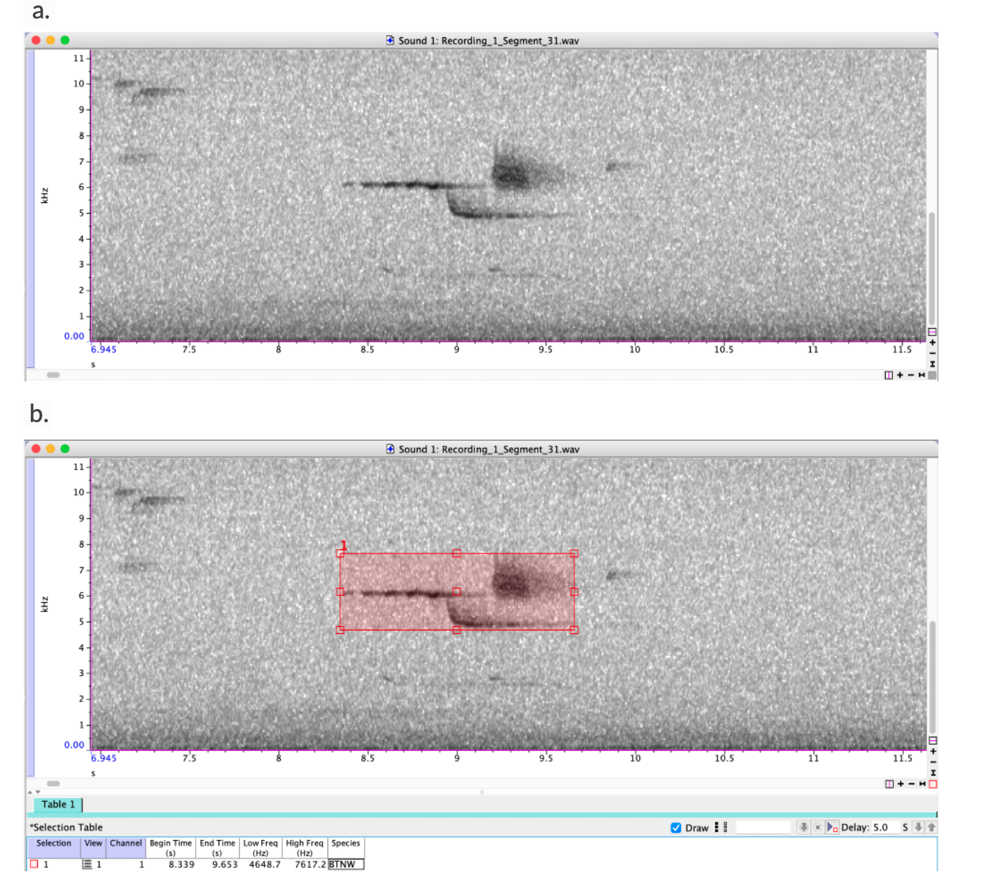

Fig. 5. A spectrogram of a recording containing a Black-throated Green Warbler visualized in RavenPro. Along the x-axis is the time and along the y-axis is the frequency (e.g., Hz or kHz). The color or value indicates how loud the sound is. The unannotated spectrogram is shown in a and the annotated spectrogram along with an annotation table ("BTNW" for Black-throated Green Warbler) is shown in b.

Before beginning annotation, you should ask yourself some questions about what you want your classifier to learn. For instance:

-   Are you only concerned with song?
-   Do you want to distinguish different song types?
-   Do you want to distinguish between adult and juvenile calls?

Knowing this helps you decide how you should annotate. For instance, if you may be interested in song types, distinguishing them during the annotation phase could be useful ("BTNW_songA" versus "BTNW_songB"). If you are interested in song only but in a more general sense, you may be able to skip annotating tedious calls.

## Step 2.5: Collect negatives

The requirement for positive examples to train a CNN on what to look for should seem obvious, but the classifier also needs to be told what **not** to look for. This can be as simple as grabbing a bunch of random clips from Xeno-canto files that don't target the sound classes. Adding clips with specific common noises like rain or wind could be helpful too.

Sometimes when a bird sounds like a lot of other things in its environment, it can be useful to also annotate a full set of clips containing any confusion species which the classifier will learn to identify as well (previously described in example 2 under How we use machine learning: CNN classification problems). For instance, if we want to train an effective classifier to ID Wood Thrush, we must also consider that the related Hermit Thrush has a very similar song that is sometimes mistaken for Wood Thrush and the two often live in the same places. Thus, we should also annotate files for Hermit Thrush.

## Step 3: Decide some visual parameters for clips

As mentioned previously, the classifiers we use only interact with audio data in the form of spectrograms. As such, it's important to make decisions about audio parameters by exploring how spectrograms of the audio look. Specifically, the classifier sees 224x224 pixel images called **tensors** (see Fig. 6). This size is a default and may be modified to be larger at the cost of prediction speed.

**While this section deals with the topic of spectrogram parameters, the parameters you choose are mostly not implemented until the training phase. The only parameter you act on at this point is choosing the clip length because you will need to generate a csv of clip start and end times for training.We highlight here other important visual parameters because these are vital to consider at the same time as you are choosing the clip length.**

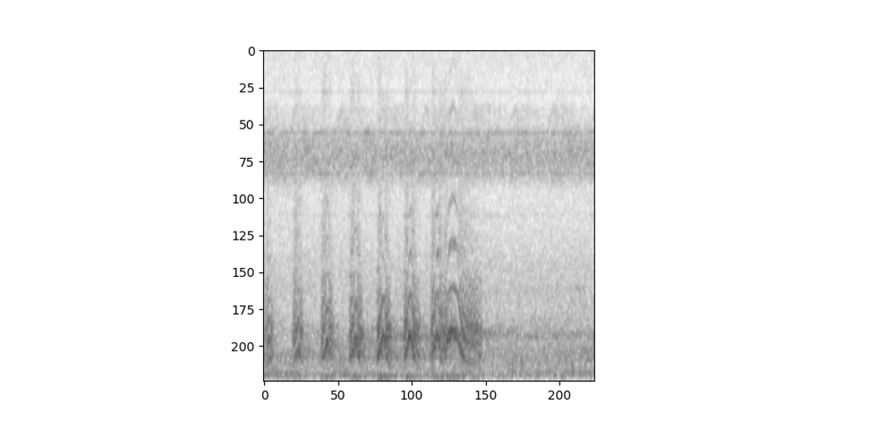

Fig. 6. An example of a 224x224 tensor which contains the spectrogram of a Barred Owl song clip of 5 seconds in length and 0-4,000 Hz in frequency.

### Clip length

Clips do not need to be any specified length--how they look visually in a 224x224 pixel image will dictate what the appropriate length is. This will also depend on other visualization parameters such as the window length and bandpass.

A balance must be struck between a clip length that is too long to show the potentially important detail of the structure of the sound in positive clips and a clip length that is too short to show the overall pattern of the sound. For instance, trimming the clip from Fig. 6 down to 1 second might give more information about the individual notes of the Barred Owl song, but it will also likely also make it harder to distinguish the song from that of Great Horned Owl which has similar notes but a different structure, or even from the barks of dogs that may occur in recordings. Below, in Fig. 7 is a nice example of the same audio file trimmed into different sized clips and the effect that has on the appearance of the target sound.

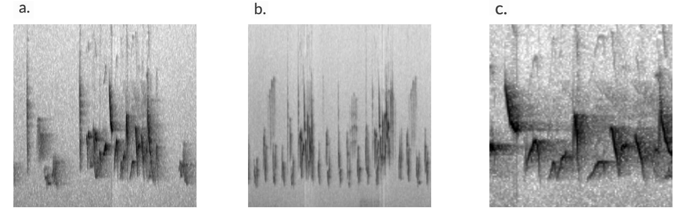

Fig. 7. A 4-second clip (a) versus a 20-second clip (b) versus a 1-second clip (c) of a Canada Warbler song. The 1-second clip does not provide enough context to necessarily make this song distinguishable from the songs of other birds while the 20-second song does not provide enough detail. The 4-second song is in the sweet spot for this species. All of these clips are displayed as 224x224 pixel tensors.

### Bandpass

To **bandpass** means to trim the frequency range of the tensor (the up-down dimension as opposed to the left-right dimension for the clip length). Just like in deciding clip length, a balance must be struck between trimming down to add detail and eliminate background "distraction" sounds, and trimming too much to provide the proper context (see Fig. 8). In some cases, bandpassing as close to a sound as possible is necessary to see as much detail as possible and limit interference by other sounds in the clips, but at other times it may make the sound appear more similar to other confusion sounds in the environment.

In a Black-billed Cuckoo classifier, a close-cropped bandpass range worked exceedingly well in Montana field data, but showed poor performance in field data from Pennsylvania because woodpecker drumming present in the East and not the West was very similar to Cuckoo sounds at the selected bandpass range. Expanding the bandpass range helped to differentiate the two because the woodpecker drums had a broader frequency range than the cuckoos. In a Great Horned Owl and Barred Owl classifier, changing the bandpass range from 0-4,000 Hz to 0-2,000 greatly improved the performance of the classifier and aided in differentiating the two species. Sometimes finding the right parameters requires experimentation.

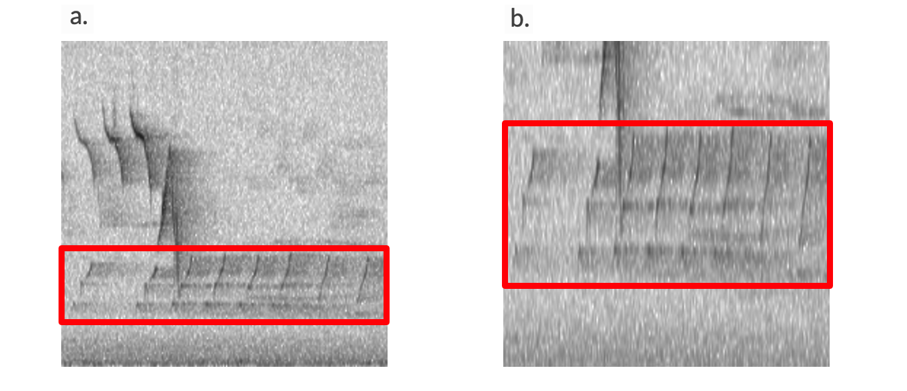

Fig. 8. Two tensors containing the same Northern Cardinal clip at different bandpass ranges (the cardinal is boxed in red). The first (a) has a bandpass range of 0-11,000 Hz which shows more background sound potentially causing a "distraction" so-to-speak. The second (b) is bandpassed closer to the target species song from 500-5,000 Hz and contains fewer background sounds.

### Window samples and overlap samples

Other parameters can be modified to help strike the balance. **Window samples** is a parameter which has to do with how sound is transformed into a spectrogram image. This transformation strikes its own balance between the level of detail visualized in time and the level of detail visualized in frequency. Higher values for window samples (e.g., 1024) will yield spectrograms with more frequency and less time resolution. Lower values for window samples (e.g., 256) will yield spectrograms with more time and less frequency resolution. Lowering window samples may reveal features such as **frequency modulation** (rapid up and down shifts in frequency) that are otherwise unapparent (see Fig. 9). Changing the window samples may also make the same call look very different on spectrograms (see Fig. 10). **Overlap samples** should typically be ½ of the value of window samples.

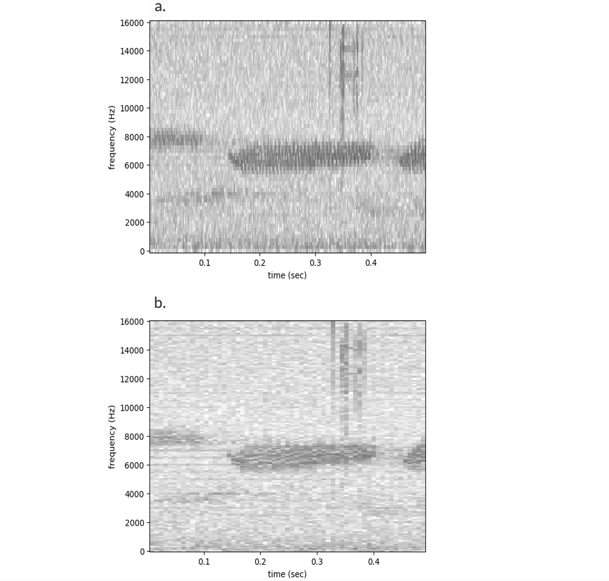

Fig. 9. An example of frequency modulation that is revealed by modifying the window_samples and overlap_samples parameters of the same 1 s clip. In a, window_samples = 128 and overlap_samples = 64. In b, window_samples = 512 and overlap_samples = 256. Frequency modulation is only apparent in a. Frequency modulation may or may not be visible when spectrograms are squished into 224x224 pixel tensors, depending on the clip length.

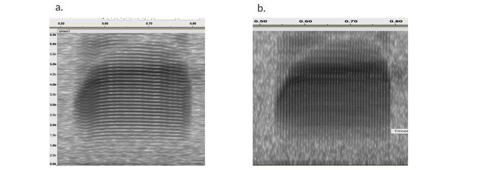

Fig. 10. Another example of how spectrogram parameters can drastically change the appearance of a sound on a spectrogram. This is the same American Woodcock call at 1024 Hz (a) and at 256 Hz (b).

A quick and easy way to investigate how window samples affect your training data is to use software such as
[Audacity](https://www.audacityteam.org/) (see Fig. 11).

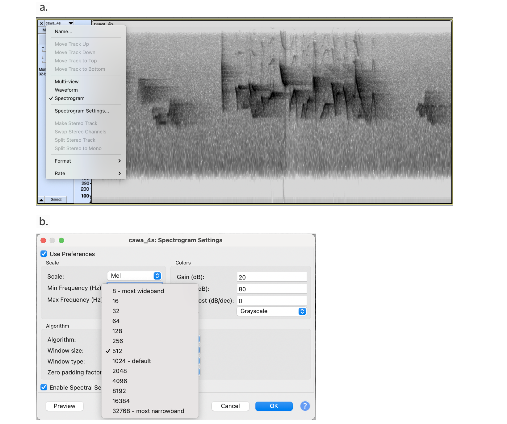

Fig. 11. Adjusting the spectrogram parameters in Audacity. Click the drop-down menu in the upper left corner of the audio panel, click "Spectrogram Settings...", and click the "Window size" dropdown menu. This also allows you to see some typical values for window size.

## Step 4: Create labels

To initiate training, the code which trains the model is provided with a **data frame** (a csv file stored in memory) that in turn links to the training data. This data frame is structured such that it has a column for the path to each recording or clip in the index, and additional columns for each class of the model.

Models vary by how many different classes of sound they can identify and how many targets they can assign to a single clip. A **single-class** model can only identify whether or not one class is present (e.g. a single species). In a single-class model, each clip is assessed for whether or not it is a "presence" or an "absence" of that one species. A **multi-class** model can identify the presence or absence of multiple species/target sounds. A multi-class model can either be **single-target** (each clip has exactly one "correct" class), or **multi-target** (each clip can have multiple classes assigned to it--or none at all).

The data frames containing training data information reflect whether models are single or multi-class, and single or multi-target. Class columns only contain 1s or 0s which indicate positive (1) and negative (0) examples for each class. Depending on model type, 1 can appear only once in each row (single-target or multi-target; see Table 1 and Table 2) or multiple times (multi-target; see Table 2). In the case of single-target models, there is an additional class for cases when an example clip does not fit into any of the other classes, typically labeled as "absent," "other," or "negative" (see Table 1). We have had success with multi-target models recently even when positive example clips are always mutually-exclusive across classes, so this is typically the option we choose.

Table 1. An example multi-class, single-target data frame. In a single-target dataframe, each row must have exactly one "1"; the other columns must be "0"s. If this were a single class problem, only the "Species_A" and "Other" columns would be needed.

  --------------------------------------------------------------
 | file                |Species_A       |  Species_B |    Other |
 | ------------------- | -------------- |------------|--------  |
 | /Path/to/clip1.wav  | 1              |   0        |       0  |
 |  /Path/to/clip2.wav | 0              |   1        |       0  |
 | /Path/to/clip3.wav  | 0              |   0        |       1  |
  -------------------------------------------------------------

Table 2. An example multi-class, multi-target data frame. In a multi-target dataframe, each row can have zero, one, or multiple "1"s. If this were a single class problem, only the "Species_A" column would be needed.

  -------------------------------------------------------------
  |file                  |  Species_A     |      Species_B      |
 | --------------------- | -------------- |-----------------    |
 | /Path/to/clip1.wav   |   1             |          0          |
 | /Path/to/clip2.wav   |  0              |         1 		|
 | /Path/to/clip3.wav   |   1             |          1 		|
 | /Path/to/clip4.wav   |   0             |          0 		|	
  ---------------------------------------------------------------

## Step 5: Balance the training dataset

A good training dataset requires "balance" to make an effective classifier. What balance means in this context is making a dataset be representative of what you would like the classifier to learn. Here's an example: let's say you create a training dataset with 100 positives and 10,000 negatives. During training, the model is frequently updated, but only the "best" model is retained (saved as "best.model" at the end). In this case, a model which simply decides that everything in the training dataset is a negative will achieve almost perfect accuracy whilst learning virtually nothing about the sound you want it to learn. The following details how we generally balance the number of positives of a class to include in the model, the number of positives across classes, the types of clips included as negatives, the ratio of positives to negatives, and splitting clips between training and validation sets.

We have found that it's a general rule of thumb that to train a decent classifier, we need at minimum 200 positive examples of each target species. Usually, we will use only the first 60 seconds of each Xeno-canto file to get these because using every positive example from a Xeno-canto file may yield datasets that are very biased towards longer files. This may make a classifier learn that it's supposed to be looking more specifically for sounds that match those of a long Xeno-canto file rather than a general pattern that the sound takes on. This same idea might apply if training using field data all from one location and/or time. Sometimes it may be necessary to use entire files if examples are very scarce, but this type of imbalance should be carefully considered.

Sometimes after annotation for classifiers with multiple target species, we find that there's a large difference in the number of positive clips available from one target species to the next. It's often best to try and balance the number of positive clips for different species lest a classifier learn one better than the other. We have two options for this: **upsampling** the species with fewer positives (duplicating some of the positives randomly) or **downsampling** the species with more positives (leaving out some of the positives randomly). By upsampling, you can retain the variability in clips from the species with more clips, but duplication of clips from the species with fewer could mean that the classifier learns that duplicated clips are more representative of what sound it's supposed to ID than ones that are not duplicated (a problem similar to the one highlighted in the previous paragraph). By downsampling, you lose some of the variability in clips from the species with more positives, but you don't run the risk described previously. Some combination of upsampling and downsampling could also be performed. Opensoundscape includes a function for [resampling clips](http://opensoundscape.org/en/latest/api/modules.html?highlight=resample#opensoundscape.data_selection.resample).

When annotating targeted recordings, inevitably there will be portions of the recordings that do not contain the target species when the recordings are converted to shorter clips. These are frequently going to be primarily silence as recordists may use parabolic microphones that exclude background noise, or they may only upload polished recordings in which background noise is minimized. If we keep all of these negatives, we run the risk of the classifier learning that the sound it needs to identify is any sound that isn't silence. Therefore, we usually only keep a small subset of these--something like 20% of the total number of negative clips used might be appropriate.

It's unclear how many negative clips are needed in total to create a decent dataset, but something on the order of 1-2x the number of total positive clips is probably reasonable in most cases.

Training a classifier requires separate **training** and **validation** datasets. The validation set is used during training to assess the performance of the classifier during training (more on this later). Typically, we have used a small subset of the training dataset as the validation set (but you could use something else such as field data during this time). We take around 20% of the training clips, remove them from the training dataset, and put them in the validation dataset. The clips put into the validation dataset should also be balanced. This means taking the same relative proportions of positive and negative clips from each class as appear in the training dataset. The Python package scikit-learn includes a function for [splitting data](http://opensoundscape.org/en/latest/tutorials/cnn_training_advanced.html?highlight=validation#Split-into-train-and-validation-sets) into training and validation datasets.

**A final note:**

**Always save your final labels as one versioned csv file.** This enables you to know precisely which data you used in training and can help you re-create a classifier in the event that it's lost. **Also, keep a record of how you create your training data and overlays.** Parameters used in creating clips such as the proportion of a vocalization that must be present to be considered a positive are not saved unless you make a record of them.

# CNN training

Training a machine learning model is the process through which the algorithm learns to predict the correct class (or classes) for a given input sample. In our case, we might want a CNN to predict the correct bird species present (classes) in a 5-second audio clip (sample). The training data we have prepared is what the algorithm will "study" to learn how to predict the correct labels for a sample. The process that the algorithm uses to "study" and learn from the training data is called training (or fitting) the model.

The strategy the CNN uses to learn from the data is similar to how you might study for a spelling or history test with flashcards: it looks at the sample, makes its best guess at the labels, then checks if it was correct and learns from its mistakes. The CNN learns best by seeing "batches" of samples, for instance, a set of 128 samples, rather than one at a time. Each sample is a **tensor** (array of numbers) created from the spectrogram, and a batch is just a stack of samples. Similar to when you study for your spelling test, the algorithm will need to study the entire set of samples multiple times; each run through all of the training samples is called an "epoch". At the end of an "epoch", we usually test how much the model has learned by having it predict the labels on the **validation dataset**. We never let the model learn from the labels on the validation dataset to improve itself, so each time we use it it acts as a fair assessment of the model (ie, the model can't memorize the answers to this assessment).

## **Behind the scenes, what is a CNN and how does it "learn"?** 

While this section is not strictly necessary for understanding how to train a classifier, it may provide you with more context for why we make the decisions we do in training CNNs. It's a good idea to understand how your tool of choice works.

### Neural networks

A neural network is a network of many nodes and connections between them, structured as a sequence of layers (see Fig. 12).

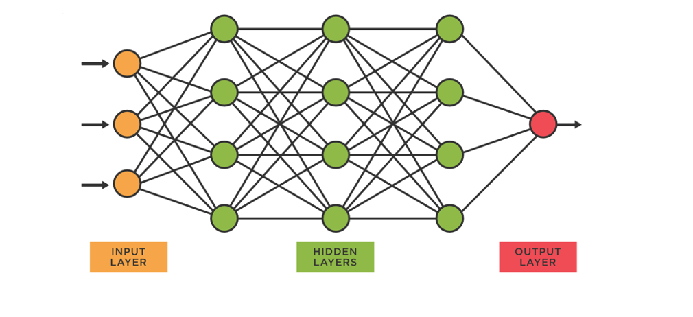

Fig. 12. A schematic of the structure of a neural network.

The nodes (colored dots) represent the data as it is transformed from the input (orange dots on left) to output (red dot on right; see Fig. 12). There will be one output node for each class the model is learning to recognize. The lines connecting the nodes are called "weights" or "parameters" and each one is a number that will be adjusted and tweaked during the training process. Getting from the input data to the output class predictions is simply a matter of multiplying the node values by the weights connecting them to a new node, and summing up the values entering a new node. For example, the bottom node of the first green ("hidden") layer receives the sum of inputs of the from the first layer multiplied by their respective weights (see Fig. 13).

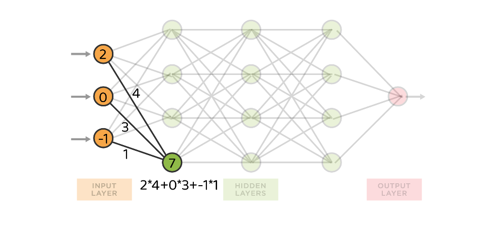

Fig. 13. Neural network schematic showing example inputs to one hidden layer.

This continues throughout the network until a value is obtained for the output layer, and that final value represents the algorithm's predicted score for each class (each output node). Often, we perform a mathematical operation called the sigmoid on the outputs so that instead of being any real number (for instance -107.5 or 3281.01) they fall in the range between 0 and 1. This lets us compare the outputs to 0/1 labels for each sample and class: we want the algorithm to score the samples labeled as "1" close to one and those labeled as "0" close to zero. The goal of the algorithm is to adjust the weights (those black line connections in Fig. 12 and Fig. 13) so that for any input sample it consistently predicts the correct classes.

### From neural networks to CNNs

A convolutional neural network (CNN) is a specialized version of a neural network designed for 2-dimensional data like images, and has a more complicated network than the diagram of a neural network above (but it is still a bunch of weights, aka parameters, and multiplication). First, remember that an image, as stored on a computer, is a 2-dimensional map of pixel values (for instance, dark pixels are low values and white pixels are high values for a black and white image). Each pixel in the picture counts as one input value (orange dots in the Fig. 12). What makes a CNN great for image classification is that it uses spatial relationships in the input data. It does this in a simple but smart way: instead of having a separate parameter for each element of the input data ("weights", black lines in the diagram above), spatially neighboring input data elements (pixels) are analyzed *as a unit*.

For example, as shown here (Fig. 14a), a 2x2 region of pixels in the image is multiplied by a 2x2 "kernel" of parameters, then all 4 values are summed (in practice, the kernels might be bigger--e.g., 7x7). The values in the kernel are parameters that the CNN adjusts during training. However, those same values of the kernel are used over and over as the kernel is moved left-right and up-down over the entire image! Why would this be a useful thing to do? Imagine a kernel like (Fig. 14b) below, and think about what sorts of pixel values multiplied by this kernel would lead to the largest output value. You might be able to tell that this kernel will produce high values for vertical lines in an image. By having many kernels, a CNN learns to recognize many shapes and this is just the first layer of the CNN. Subsequent layers that each take the previous layer as input will learn more and more complex elements of the input sample. The very last two layers of a CNN look just like those of the neural network shown above (Fig. 12 and Fig. 13), so that it still has one output node for each class it is trying to predict. (This is called a "fully connected layer").

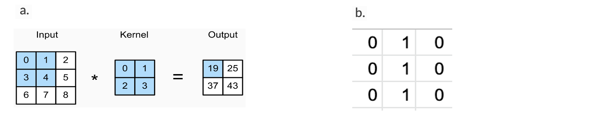

Fig. 14. Example of how kernels work on images to generate predictions.

## Batches and epochs

As described at the start of this section, a CNN learns on batches of clips viewed many times. There will usually be multiple batches of clips viewed each epoch, model weights are updated from epoch to epoch, models are evaluated at the end of each epoch to determine how they perform on the validation dataset, and the final epoch during training does not necessarily produce the best model.

We have typically used 20-100 epochs as our standard for training models, but this is not necessarily the correct choice in every case. Too high and a model may "overfit" to a dataset (i.e., it thinks only clips exactly like the training clips are the target sound for its classes). Too low and it might not learn enough about the target sound(s). You may choose to investigate how much performance changes from epoch to epoch throughout the training process to make a decision.

## Preprocessing

Preprocessing basically means what parameters are applied to create the tensors. You already saw some of these parameters in the previous section such as **bandpass range**, **window samples**, and **overlap samples**. During training is where these parameters actually come into effect. Also part of preprocessing are **overlays** and **overlay weights**, or the weight (e.g., 0.5) or random range of weights (e.g., 0.3-0.7) applied to the overlay when the overlay and underlying training image are averaged together.

### Data augmentation

In each epoch, the classifier does not see precisely the same image every time. Instead, to increase its ability to generalize the features of the image that it's learning, it gets a modified, or "augmented" version of the image which differs a bit each epoch. The parameters used in augmentation of the image are also part of the preprocessor. Overlays are considered part of augmentation.

By default, images are augmented in a couple ways: horizontal and vertical gray bars are overlaid, and the tensor is trimmed a bit around the edges (see Fig. 15). From epoch-to-epoch, these shift a little and any overlays hop around between underlying training images.

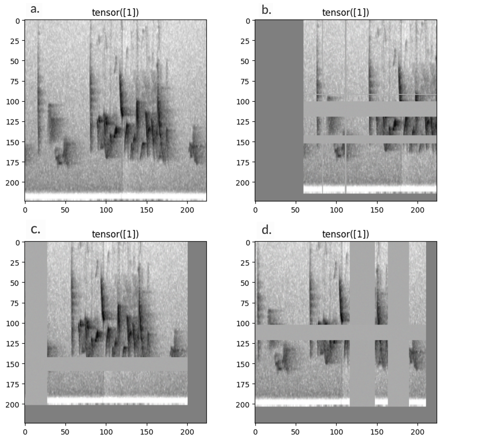

Fig. 15. The original tensor (a) versus the same tensor with default augmentation applied in three different epochs (b-d).

The augmentation performed to the training data can be changed by removing augmentations, or adding pre-built augmentations (such as overlays), but besides applying overlays, we generally do not make changes to the default data augmentation.

# Testing a CNN

**You should not simply trust that a final classifier is a good one. Often, first classifiers will not perform very well in a real-world setting. Thus, you first have to assemble a test set that mimics the real-world setting, and then apply one of multiple methods of examining classifier performance, including calculating performance metrics or examining histograms.**

## Assembling an appropriate test set

Testing performance of a classifier really comes down to the **test set**. Like the **validation set**, the test set is used to assess the performance of a classifier. Unlike the validation set, you predict on the test set separately outside of model training. Unlike the validation set, the test set is not used to decide during training which version of the classifier is the best one. That's not to say the clips in the test set and the validation set are mutually exclusive, however. These terms simply describe where and when you are predicting on a set of clips.

You may be tempted to use targeted recordings that you didn't use in training to test the classifier, but these will not provide accurate estimates of how your classifier is performing in a real-world scenario. To test classifiers, you really want to use annotated field data and preferably field data which is representative of the recordings you will be predicting on.

Acquiring said recordings can be tough. Some potential options you could try are as follows:

a.  From fully-annotated soundscapes. A list of some of these that are available to use is at the [bottom of the document](#additional-resources).Preferably, a fully annotated soundscape would be produced from randomly sampling all  audio data available in a larger dataset. Keep in mind, using overlays from these data will specifically increase performance on them, especially if you do not exclude clips you used as overlays.

b.  From cards where point-counters found the species of interest. These may still be a chore to skim through for the target species, but this might be the best bet for rare species that you are unlikely to encounter while listening to random data. Aim also to get examples from more than one site as individuals may vary in their vocalizations.

c.  By predicting on a whole field dataset. You can listen to the high-scoring clips from the set and find some that contain the species of interest. However, note that this may introduce  biases to your test dataset, as it will only turn up recordings that the classifier already scored relatively highly.

d.  Using a clustering algorithm to find when/where the sounds you want are occurring. Note this may also be a biased approach that leads you to missing variations in the sound you are interested in.

Preferably, a test set should include several dozen positive examples of a target sound but even a handful can give you an idea of score separation between true positives and true negatives. Field data annotated for the target species can be combined with other fully-annotated soundscapes that do not contain the target sounds to get a better picture of how the classifier performs on a variety of data.

## Precision and recall

One of the more universally-accepted ways of testing CNN performance is by examining **precision** and **recall**. These can be hard metrics to remember and get straight.

First though, let's talk about **score thresholds**. The score threshold is a value above which you consider all clips to be positive for the target species/sound and below which you consider them all to be negative. Of course, unless your classifier perfectly identifies sounds, there will be errors in the form of false positives and false negatives. Some of the clips above the threshold will be **false positives** which do not actually contain the target sound. Likewise, some of the clips below the threshold will likely be **false negatives**, which actually do contain the target sound. In contrast, correctly-identified sounds at a given threshold are referred to as **true positives** and **true negatives** (see Table 3).

Table 3. Demonstration of true and false positives and negatives. Columns are the true state of a sound in a clip while rows are the predicted state of a sound in a clip.

|                     | Present              |    Absent          |
| ------------------- | -------------------- |------------------- |
| Predicted present   |    True positive     |     False positive |
| Predicted absent    |   False negative     |     True negative  |

When you select a threshold, you can use the labeled dataset to determine the classifier's performance at that threshold. **Precision** is the number of true positives out of the number of all positives  at that particular threshold. **Recall** is the number of true positives out of the number of all clips that actually contain the target sound <ins> at that particular threshold <ins> (see Fig. 16).

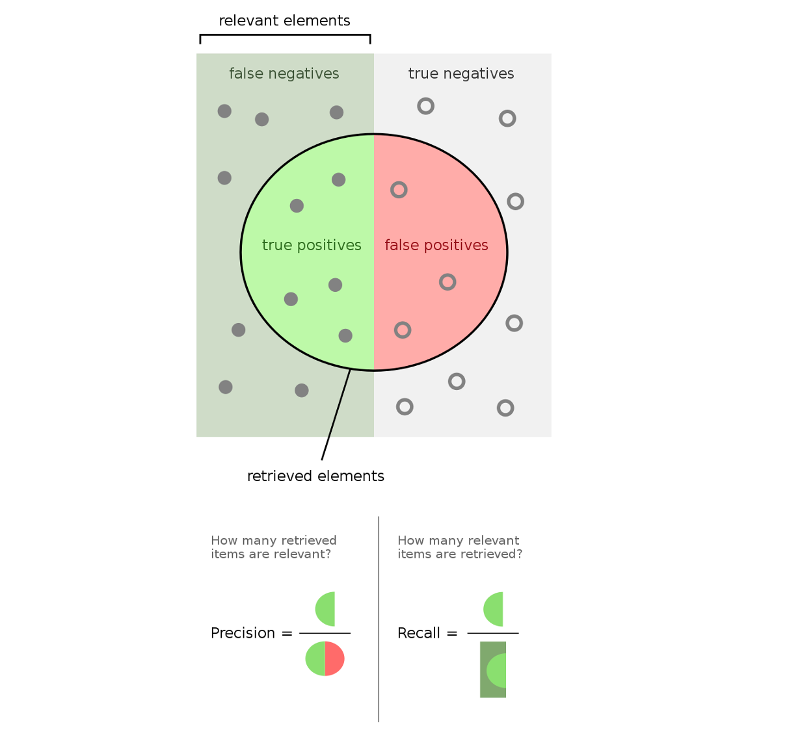

Fig. 16. A visual demonstration of the meaning of precision and recall. Source: [https://en.wikipedia.org/wiki/Precision_and_recall](https://en.wikipedia.org/wiki/Precision_and_recall)

Often, these are displayed as "PR curves" where recall is plotted against precision by varying the threshold used (see Fig. 17a and Fig. 17c). However, PR curves don't usually indicate which combination of precision and recall corresponds to which threshold. Therefore, it can be easier to interpret as a plot of separate precision and recall lines against threshold, because this can help you see which numerical choice of threshold results in a particular combination of precision and recall (see Fig. 17b and Fig. 17d). There's no simple answer for what a good precision-recall curve looks like because you may prioritize one or the other depending on the project, but generally if you can get >0.7 precision *and* recall, this is a good sign. Fig. 17a and 17b show very good performance while 17c and 17d show very poor performance.

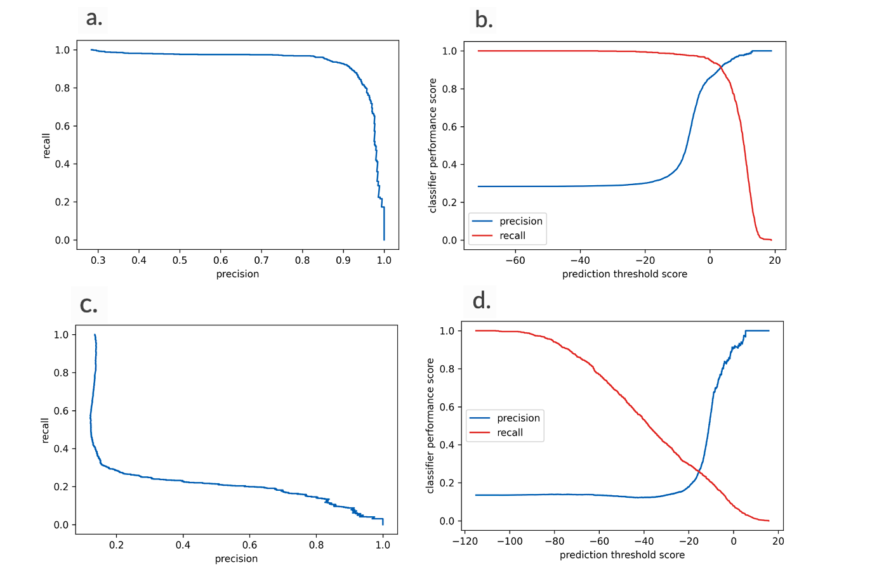

Fig. 17. Examples of typical precision-recall curves (a and c) and a threshold versus precision and recall plots (b and d). All of these plots pertain to the very same model--the only difference is the test dataset. A and b are with respect to a test dataset that is very similar to the training data used to create the model. C and d pertain to test data from different domains.

## Score histograms

Frequently, we have found ourselves favoring the use of histograms to display the distributions of true positive and true negative scores from test sets. These provide an easily interpretable way to see how well the classifier differentiates positive and negative clips. They may also provide clues as to how a classifier performs on variations of the target sound or potential confusion sounds (i.e., sounds which are similar to the target sound and may be confused with it). The greater the separation between the true positives and the true negatives, the better the classifier is doing (see Fig. 18). Each plot in Fig. 18 has some issues, but we were generally satisfied with the performance of the classifiers in Fig. 18a, 18b, and 18d. Fig. 18a and Fig 18b both show left skews in the true positives. This may have been caused by partial vocalizations in the test set clips which were marked as true positives. Fig. 18c below shows an example of a bimodal histogram. In this instance, it was caused by another type of vocalization produced by the bird in question which was not well-represented in the training dataset.

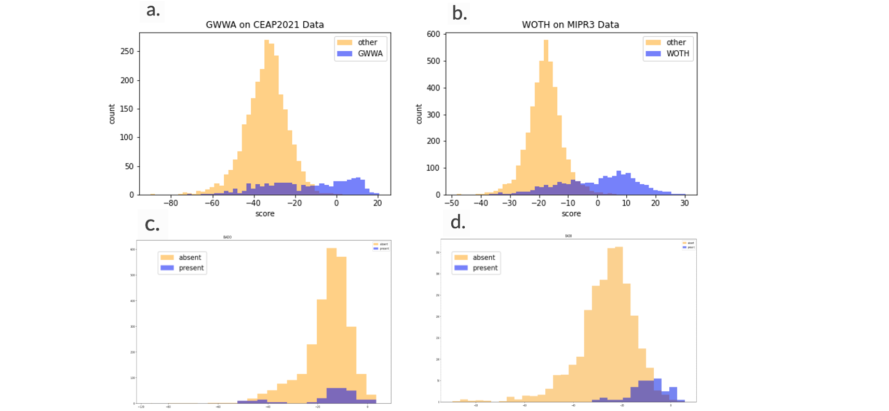

Fig. 18. Some example score histograms. The top row (a and b) are considered to be good classifier performance. There is overlap between the true positives (blue) and the true negatives (orange), but that's not something that will ever be realistically eliminated. At the bottom (c and d) is a comparison of the same classifier, retrained using different clips/parameters to classify Barred Owls. Performance in c wasn't great with the true positives occurring at highest frequency at about the same score threshold where true negatives were occurring at highest frequency. Also note that some of the true positives form a second distribution at the tail. After retraining in d, the score distribution is considered much more acceptable for this same test set.

## A case study: Great Horned Owl begging calls

We created a classifier to detect the begging calls of Great Horned Owls using Xeno-canto recordings and overlays from field audio data collected along the East Coast. Incidentally, we had an excellent opportunity to collect audio recordings of begging calls right by a known nest of Great Horned Owls in Montana. So, we opportunistically collected begging calls with the intention of using the recordings to test our classifier. One thing to note though is that Montana is very far from the location where we intended to use the classifier and far from the place of recording of overlays we used for training (the East Coast). These Montana recordings ended up being different from our East Coast recordings in some important ways: we collected them using Song Meter Micros instead of AudioMoths, passerines in Montana sing well into the night, and there was a high concentration of birds in general at the site we collected recordings at in Montana leading to quite a lot of noise.

We then tested the classifier on this Montana test set and found it to be extremely bad at differentiating true positive and true negative clips (see Fig. 19a). Fortunately, however, we also had a test set from the East Coast. When we tested the classifier on the East Coast test set, classifier performance was astonishingly good (see Fig. 19b)! This is an excellent example of how different test sets can give very different estimates on the performance of CNNs, and how domain differences can wildly impact estimates of performance.

For precision and recall on these two test datasets, see Fig. 16 above.

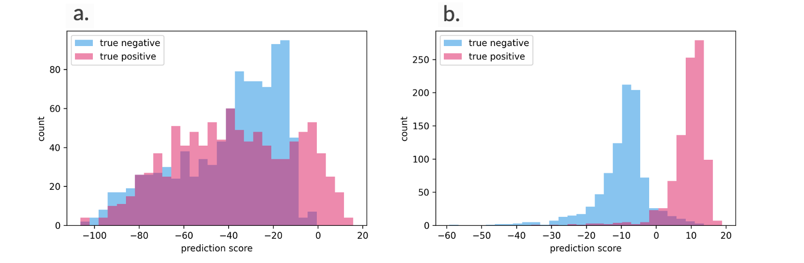

Fig. 19. Histograms of the true positives and true negatives scores from the same classifier on two different test datasets (a from Montana and b from the East Coast).

# Further steps

So you've trained a classifier, tested its performance, and now you're wondering what to do next. Should I retrain based on performance on the test set or proceed? There's no right answer, but keep in mind, **the classifier does not need to be perfect, only useful.**

## Retraining the classifier

While it is possible to load your previously trained classifier and proceed with additional training on new training data, we typically start from scratch with a new version of a classifier if we wish to retrain.

At this stage, you should gather information on what is causing poor performance of the model. Do you suspect that the classifier might perform better if you tweak parameters such as bandpass? Do you think that there's some confusion sounds that the classifier really ought to learn are not the target sound? The best way to answer such questions is to look at the high-scoring negatives from your test set, and the low-scoring positives. If you see a pattern of many of the same confusion sounds, perhaps they're the key. If there's little pattern that you can tell, maybe your classifier isn't learning enough about the target sound and requires different preprocessing parameters. Some options are:

a.  Tweak preprocessing parameters so that training samples more clearly show distinctive features of the target sound.<br>

b.  Add confusion sounds into the negatives. For instance, if your Common Nighthawk model keeps scoring American Woodcock highly, you could add more clips from Xeno-Canto American Woodcock files into your negatives.<br>

c.  Add high-scoring negatives from the test set into the overlays. This can increase the variety of sounds the classifier is exposed to but keep in mind that these clips will now score lower when predicting on the test set.<br>

d.  Add another class to the classifier containing a confusion species. This may help in instances where it's difficult to differentiate two species--for instance, telling apart Black-throated Blue Warbler and Cerulean Warbler songs can be challenging to the untrained observer. Including both can give the classifier more specificity to the target species.<br>

e.  Include more positive training examples. Maybe the classifier simplydoesn't have enough to work off of. Including the first 120 rather than the first 60 seconds of Xeno-canto recordings in a two-class Barred Owl/Great Horned Owl classifier increased performance despite already having the target 200 positive examples for each class.<br>

# Additional resources

For additional information, please see this list of [Bioacoustics Resources](https://docs.google.com/document/d/10APGahxU_GJewO8mkN2wzG0y-LHw3p_TAcYJDdHAQmg/edit#heading=h.mwbyo5325flj) curated by the Kitzes Lab.


